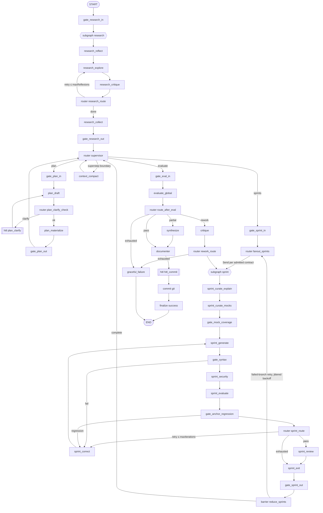

# Architecture: Prompt Graph Engineering (PGE) Execution Layer

**Architecture ID:** arch-20260805-pge-graph-engineering
**Generated:** 2026-08-05
**Status:** draft

---

## Executive Summary

This design makes agent-bober's orchestration topology an explicit, serializable, versioned artifact (`.bober/topology/<graphId>.json`) validated by Zod, and executes that artifact with a native TypeScript superstep interpreter rather than adopting LangGraph in either language. The topology layer ships first and standalone — it delivers G1 (inspectable structure), G2 (topology/content separation) and G4 (CI-gateable, optimisable artifact) with zero new dependencies and zero runtime change, describing the shipped imperative pipeline before any engine exists. The runtime layer then adds G3 (scheduling, dynamic routing, bounded loops, fan-in reducers, durable resume) behind the private `PipelineEngine` seam, default-off, with `TsPipelineEngine` retained permanently as the conformance oracle. The tradeoffs accepted are a hand-owned Pregel (~1,400 non-test lines across eight modules, not one loop) and a stringly-typed registry indirection, bought for zero vendor coupling in the execution core, interrupts at superstep boundaries rather than mid-node, and order-invariant fan-in that makes conformance and replay decidable. The primary risk is silent state-corruption in bespoke barrier/resume/commit semantics with no upstream maintainer, mitigated by three blocking invariant suites plus an adversarial checkpointer conformance suite.

---

## Problem Statement

**Problem:** The execution topology exists only as imperative control flow inside `src/orchestrator/pipeline.ts` (1,094 lines, ~34 inline `.bober/` write sites, sequential sprint loop at `:976-987`), so it cannot be validated, visualized, diffed, versioned or optimised without running it, and no trace records what executed.

**Constraints:**
- Latency: **not a design input.** Over 34 specs / 175 sprints the dependsOn-aware parallel ceiling is 1.34x, 15 of 34 specs are pure linear chains, and in the best case (3.33x) concurrently-schedulable sprint pairs collide on the same files in 8 of 10 pairs (`agentic-loop.ts` in 6). No acceptance criterion here asserts wall-clock speedup.
- Data volume: single-channel state values capped at 4 KiB (`maxInlineBytes`); larger payloads are offloaded by content hash.
- Cost ceiling: per-run USD ceiling enforced by a typed budget error; per-node accounting required.
- Backward compatibility: `runPipeline(userPrompt, projectRoot, config, opts)` frozen (`pipeline.ts:1074`); `PipelineResult` field set frozen (`pipeline.ts:66`); `.bober/` artifact shapes frozen; the `pipeline-complete` history event and `.completed.json` marker must be emitted identically by every engine or `src/chat/completion-tailer.ts:181` hangs forever.
- Distribution: npm CLI symlinked into arbitrary user projects. No service the user must run, no second language runtime, no per-platform binary.

**Consumers:** `bober run` (`cli/commands/run.ts:181`), MCP `RunManager` (`mcp/run-manager.ts:201`), worktree runner (`orchestrator/worktree.ts:143`), fleet children and chat-spawned runs (both via the `agent-bober run` verb + exit code), team routing (`teams/registry.ts:34`), the 9-site checkpoint subsystem, and `medical/engine.ts:191` as a second `PipelineEngine`.

**Success Criteria:**
- `bober pge validate` exits non-zero with a distinct named code for each of 30 malformed fixtures, with zero node executions enforced by a module-graph boundary, not by assertion.
- The same golden spec at concurrency 1 and concurrency 8 produces byte-identical `.bober/` artifacts.
- A run killed after node 3 and restarted in a **fresh process** re-invokes zero of nodes 1–3 and yields the uninterrupted run's artifact.
- `EngineConformanceHarness` reports `equivalent: true` for `ts` vs `pge` across 11 artifact fields on the golden spec.
- A non-empty topology diff without a `graphVersion` bump fails CI.

**Locked Dependencies:** Zod as the only validation layer. Filesystem-only state under `.bober/`. TypeScript strict + ESM/NodeNext. No SDK lock-in in the execution path. Existing agent functions (`runPlanner`, `runGenerator`, `runEvaluatorAgent`, `runCurator`, `runResearch`, `runCodeReviewer`, `runDocumenter`) reused unmodified as node bodies.

---

## System Overview

Two layers, one-way dependency. **Layer A (topology)** is `src/pge/topology/**` plus `src/contracts/topology.ts`: a Zod artifact, a 30-rule validator, and a toolkit (hash, render, diff, docs-drift, state-audit, optimize). An ESLint `no-restricted-imports` boundary forbids importing `src/pge/runtime/**`, `src/pge/nodes/**`, `src/orchestrator/**` and `src/providers/**` — the identical scoped idiom already enforcing local-only telemetry (`eslint.config.js:46-48`) and zero-egress medical (`:75-77`). Zero-execution during validation is therefore a property of the module graph, not of a test.

The authoring source is a **plain typed object literal** — `export const CODING_GRAPH: TopologySpec` in `src/pge/topology/coding.graph.ts` — not a builder DSL. `bober pge dump` parses it through `TopologySpecSchema`, canonicalises, checksums, writes `.bober/topology/<graphId>.json`; `--check` fails on any byte difference. **Layer B (runtime)** loads that JSON, never the TS module, so the committed artifact is load-bearing and cannot decay into documentation.

Layer B is a Pregel superstep loop: plan frontier → admit → execute under the shipped `Scheduler`/`Semaphore` → barrier → commit once → checkpoint → route. Every side effect is declared on its node as an `EffectTag` and performed through a single `EffectRegistry`; `CommitBoundary` is the sole writer of `.bober/` domain artifacts and the sole `new Date()` source, generalising `RunResultFlusher` (`flusher.ts:23-104`) from a one-shot flush to a per-superstep boundary. Interrupts fire **between** supersteps, before node execution, so no node body re-runs on resume.



---

## Component Breakdown

### TopologySpec (schema)
**Responsibility:** Define, as Zod, every legal node kind, edge kind, port, channel, policy and route label a topology may contain.
```typescript
// src/contracts/topology.ts
export type NodeKind = "llm" | "tool" | "gate" | "router" | "subgraph";  export type EffectTag = "fs-write" | "git" | "network" | "process-exec";
export const RouteTargetSchema = z.object({ label: z.string().min(1), to: EndpointSchema });   // closed outcome-label set — see ADR-3
export const LoopBoundSchema = z.object({ counterKey: z.string(), maxIterations: z.number().int().min(1), onExhausted: z.string() });
export const PortSchema = z.object({ key: z.string(), schemaRef: z.string(), required: z.boolean().default(true) });
// writers/readers are NOT stored on channels — they are DERIVED from nodes[].writes/reads (single encoding).
export const ChannelDeclSchema = z.object({ id: z.string(), reducerRef: z.string(), schemaRef: z.string(), scope: z.enum(["public","private"]), maxInlineBytes: z.number().int().default(4096) });
export const TopologySpecSchema = z.object({
  formatVersion: z.literal(1), graphId: z.string().min(1), graphVersion: z.string().regex(/^\d+\.\d+\.\d+$/), description: z.string().min(1),
  provenance: z.enum(["authored","optimizer"]).default("authored"), entry: EndpointSchema, defaults: GraphDefaultsSchema,
  channels: z.array(ChannelDeclSchema), nodes: z.array(NodeSchema).min(1), edges: z.array(EdgeSchema), checksum: z.string().regex(/^sha256:[0-9a-f]{64}$/),
  subgraphs: z.array(z.object({ id: z.string(), graphId: z.string(), depth: z.number().int().max(2), entryGate: z.string(), exitGate: z.string(), persistence: z.literal("inherit") })),
});
export type TopologySpec = z.infer<typeof TopologySpecSchema>;
```
**Dependencies:** [SchemaCatalog]

### TopologyValidator
**Responsibility:** Apply every named structural rule to a topology artifact and return diagnostics, without importing or executing any node.
```typescript
// src/pge/topology/validate.ts
export type DiagnosticCode = // 30 codes, one malformed fixture each
  | "EmptyGraph" | "DuplicateNodeId" | "DuplicateEdgeId" | "DanglingEdge" | "UnreachableNode" | "NoTerminalPath" | "UndeclaredPort" | "PortTypeMismatch"
  | "UndeclaredChannel" | "MissingReducer" | "ChannelDeclMismatch" | "MultipleWritersOnScalarChannel" | "NonAssociativeReducerUnderFanOut" | "UnboundedCycle"
  | "UndeclaredRouteLabel" | "RouterTargetNotDeclared" | "BoundaryNotGated" | "NestedCheckpointer" | "SubgraphDepthExceeded" | "SubgraphExitNotSupervisor"
  | "CacheOnEffectfulNode" | "InterruptInsideFanOut" | "EffectfulNodeContainsHitl" | "PromptRefOnToolNode" | "MissingPromptRef" | "UnknownPromptRef"
  | "ModelTierMismatch" | "ChecksumStale" | "UndocumentedNode" | "HitlWithoutOnReject";
export interface ValidationDiagnostic { code: DiagnosticCode; severity: "error" | "warn"; message: string; nodeIds: string[]; edgeIds: string[]; path?: Array<string | number> }
export interface ValidationReport { ok: boolean; spec: TopologySpec | null; diagnostics: ValidationDiagnostic[] }
export function validateTopology(raw: unknown, opts?: { mode?: "structural" | "full"; schemas?: SchemaCatalog; prompts?: PromptRefSet }): ValidationReport;
```
`mode:"structural"` uses only the artifact and works on any JSON file including a base-branch artifact fetched in CI; `mode:"full"` additionally resolves `schemaRef` and `promptRef`. Two modes exist because a base-branch artifact may name refs absent on head — the CI diff gate uses `structural`.
**Dependencies:** [TopologySpec, SchemaCatalog]

### TopologyToolkit
**Responsibility:** Derive canonical form, checksum, diagram, structural diff, doc-drift report, state audit and optimised variants from the artifact alone.
```typescript
// src/pge/topology/{canonical,render,diff,docs,audit,optimize}.ts
export function canonicalize(spec: TopologySpec): string;   // sorted keys, arrays by id, checksum elided
export function checksumTopology(spec: TopologySpec): `sha256:${string}`;   export function renderTopology(spec: TopologySpec, format: "mermaid" | "dot"): string;
export interface TopologyDiff { empty: boolean; graphVersion: { from: string; to: string; bumped: boolean }; nodesAdded: string[]; nodesRemoved: string[]; nodesRenamed: Array<{ from: string; to: string }>; nodesChanged: Array<{ id: string; fields: string[] }>; edgesAdded: string[]; edgesRemoved: string[]; channelsAdded: string[]; channelsRemoved: string[]; routeLabelsAdded: Array<{ router: string; label: string }>; routeLabelsRemoved: Array<{ router: string; label: string }> }
export function diffTopology(a: TopologySpec, b: TopologySpec): TopologyDiff;
export function checkDocDrift(spec: TopologySpec, docPath: string): string[];
export interface StateAudit { generatedFrom: { graphId: string; checksum: string }; keys: Array<{ key: string; writers: string[]; readers: string[]; reducer: string }> }
export function generateStateAudit(spec: TopologySpec): StateAudit;     // derived from nodes[].writes/reads
export function optimizeTopology(spec: TopologySpec, mutate: (s: TopologySpec) => TopologySpec): { spec: TopologySpec; report: ValidationReport };   // sets provenance:"optimizer"
```
**Dependencies:** [TopologySpec, TopologyValidator]

### Registries (NodeRegistry, ReducerRegistry, EffectRegistry)
**Responsibility:** Resolve every topology string reference to a typed executable binding and reject both unbound references and orphan bindings.
```typescript
// src/pge/registry/{nodes,reducers,effects}.ts
export interface NodeContext {  // `priv` is PrivateState — a fresh Map per task, never a channel, dropped at node exit
  readonly runId: string; readonly projectRoot: string; readonly config: BoberConfig; readonly nodeId: string; readonly branchKey: string | null;
  readonly superstep: number; readonly spanId: string; readonly priv: Map<string, unknown>; readonly clock: Clock; readonly signal: AbortSignal;
  readonly effects: EffectRegistry; readonly scratch: ScratchStore; readonly archive: ArchiveHandle; readonly cache: SemanticCache;
  readonly trace: TraceWriter; readonly ledger: BudgetLedger; readonly prompts: PromptStore; readonly models: ModelBinder;
}
export interface Goto { kind: "label" | "node" | "fanout" | "parent"; label?: string; node?: string; sends?: Array<{ branchKey: string; input: unknown }> }
export interface Command<U> { update?: U; goto: Goto; phase?: Phase }
export type NodeHandler<I, O> = (input: I, state: Readonly<OverallState>, ctx: NodeContext) => Promise<Command<Partial<OverallState>> & { output: O }>;
export interface NodeImpl<I = unknown, O = unknown> { readonly id: string; readonly kind: NodeKind; readonly inputSchema: z.ZodType<I>; readonly outputSchema: z.ZodType<O>; readonly handler: NodeHandler<I, O> }
export interface NodeRegistry { register<I, O>(impl: NodeImpl<I, O>): void; get(id: string): NodeImpl | undefined; ids(): string[] }

export interface Reducer<T> {  // all four flags are literal `true` — a non-join-semilattice reducer is unregisterable at the type level
  readonly id: string; readonly identity: T;
  readonly associative: true; readonly batchingInvariant: true; readonly orderInvariant: true; readonly idempotent: true;
  merge(current: T, updates: readonly T[]): T;              // called ONCE per channel per superstep with the whole batch
}
export interface ReducerRegistry { get(id: string): Reducer<unknown> | undefined; ids(): string[] }
export interface EffectDef<Req, Res> { readonly name: string; readonly requestSchema: z.ZodType<Req>; readonly responseSchema: z.ZodType<Res>; readonly effects: readonly EffectTag[]; run(req: Req, ctx: NodeContext): Promise<Res> }
export interface EffectRegistry {
  register<Req, Res>(def: EffectDef<Req, Res>): void;
  invoke(name: string, req: unknown, ctx: NodeContext): Promise<unknown>;
  list(): Array<{ name: string; effects: readonly EffectTag[] }>;
  seal(): void;                                             // after seal(), invoke() throws EffectChannelClosed
}
export class EffectNotDeclaredError extends Error { readonly nodeId: string; readonly effect: EffectTag }
export class EffectChannelClosed extends Error {}
```
Effect tags make `CacheOnEffectfulNode`, `EffectfulNodeContainsHitl` and the git-behind-HITL rule mechanically checkable from the artifact; `seal()` is invoked by `bober pge dump`, so the topology-production path cannot perform an effect even if the module boundary is later widened.
**Dependencies:** [ScratchStore, ArchiveWriter, SemanticCache, TraceWriter, BudgetLedger, SandboxRunner]

### TopologyCompiler
**Responsibility:** Turn a validated artifact plus registries into a `CompiledGraph` with resolved adjacency, node implementations, reducers and proven port assignability.
```typescript
// src/pge/compile/compiler.ts
export interface CompiledGraph {
  readonly spec: TopologySpec; readonly nodes: ReadonlyMap<string, { spec: NodeSpec; impl: NodeImpl }>; readonly adjacency: ReadonlyMap<string, readonly EdgeSpec[]>;
  readonly channels: ReadonlyMap<string, { decl: ChannelDecl; reducer: Reducer<unknown> }>;
  readonly subgraphs: ReadonlyMap<string, CompiledGraph>;   // no checkpointer field — nesting one is unrepresentable
}
export class TopologyCompileError extends Error { readonly diagnostics: ValidationDiagnostic[] }
export function compile(spec: TopologySpec, reg: Registries): CompiledGraph;   // throws UnregisteredNodeImpl | OrphanNodeImpl
export function loadCompiledGraph(projectRoot: string, graphId: string, reg: Registries): Promise<CompiledGraph>;  // reads the JSON ARTIFACT
```
**Dependencies:** [TopologySpec, TopologyValidator, Registries]

### GraphInterpreter and FrontierPlanner
**Responsibility:** Execute a `CompiledGraph` as a superstep loop, admitting only tasks whose dependencies are satisfied and whose file sets are disjoint.
```typescript
// src/pge/runtime/{interpreter,frontier}.ts
export interface RunContext { runId: string; projectRoot: string; config: BoberConfig; clock: Clock; signal: AbortSignal; checkpointer: GraphCheckpointer; trace: TraceWriter; interrupts: InterruptController; scheduler: Scheduler; ledger: BudgetLedger; durability: "exit" | "superstep" }
export type GraphRunResult = { status: "completed"; state: OverallState; verdict: "success" | "partial" | "failed"; supersteps: number }
  | { status: "interrupted"; checkpointRef: CheckpointRef; pending: InterruptRecord } | { status: "aborted"; reason: string; checkpointRef: CheckpointRef };
export interface GraphInterpreter {
  run(g: CompiledGraph, init: OverallState, ctx: RunContext): Promise<GraphRunResult>;
  resume(g: CompiledGraph, ref: CheckpointRef, resumeValue: unknown, ctx: RunContext): Promise<GraphRunResult>;
}
export interface PendingTask { taskKey: string; nodeId: string; branchKey: string | null; input: unknown; contractId?: string; dependsOn: string[]; files: string[] }
export interface AdmissionDecision { admit: PendingTask[]; defer: Array<{ task: PendingTask; reason: "dependsOn" | "fileConflict" | "concurrencyCap"; blockedBy: string[] }> }
export interface FrontierPlanner { plan(pending: readonly PendingTask[], done: ReadonlySet<string>, cap: number): AdmissionDecision }
```
`FrontierPlanner` is the first consumer of `SprintContract.dependsOn` (declared at `sprint-contract.ts:92`, read by no scheduler). `cap` defaults to 1.
**Dependencies:** [TopologyCompiler, FrontierPlanner, CommitBoundary, FsCheckpointer, InterruptController, TraceWriter, ArchiveWriter]

### CommitBoundary
**Responsibility:** Be the single write boundary and single clock source — apply each channel reducer once per superstep with the whole batch, enforce the state-size guard, persist artifacts.
```typescript
// src/pge/runtime/commit.ts
export interface ChannelUpdate { channel: string; nodeId: string; branchKey: string | null; value: unknown }
export interface CommitResult { state: OverallState; writesPerChannel: Record<string, number>; rejected: StateBloatError[] }
export class StateBloatError extends Error { readonly channel: string; readonly bytes: number; readonly limit: number }
export interface CommitBoundary {
  commit(g: CompiledGraph, current: OverallState, batch: readonly ChannelUpdate[], ctx: RunContext): Promise<CommitResult>;
  finalize(state: OverallState, ctx: RunContext): Promise<PipelineResult>;
}
```
Invariant asserted by a write-counter spy: `writesPerChannel[c] === 1` per superstep regardless of branch count.
**Dependencies:** [Registries, finalizePipelineRun]

### FsCheckpointer and InterruptController
**Responsibility:** Persist superstep checkpoints as JSON so a run survives process exit, and raise/resolve human-in-the-loop interrupts at superstep boundaries.
```typescript
// src/pge/runtime/{checkpointer,interrupt}.ts
export interface Checkpoint { runId: string; superstep: number; graphId: string; graphVersion: string; checksum: string; state: OverallState; pending: readonly PendingTask[]; completedTaskKeys: readonly string[]; interrupt: InterruptRecord | null; createdAt: string }
export type CheckpointRef = { runId: string; superstep: number };
export interface GraphCheckpointer {  // put() is temp-file + rename, so a partial checkpoint is never readable
  put(cp: Checkpoint): Promise<CheckpointRef>; get(ref: CheckpointRef): Promise<Checkpoint>;
  latest(runId: string): Promise<Checkpoint | undefined>; list(runId: string): AsyncIterable<CheckpointRef>; prune(runId: string, keep: number): Promise<void>;
}
export function createFsCheckpointer(projectRoot: string): GraphCheckpointer;  // projectRoot required; no module-level instance
export interface InterruptRecord { checkpointId: CheckpointId; nodeId: string; branchKeys: string[]; payload: unknown; raisedAt: string; superstep: number }
export class GraphInterrupted extends Error { readonly record: InterruptRecord }
export interface InterruptController {
  maybeInterrupt(node: NodeSpec, payload: unknown, ctx: RunContext): Promise<CheckpointOutcome>;
  raiseSuspend(record: InterruptRecord): never;
  applyResume(cp: Checkpoint, value: unknown): Checkpoint;
}
```
`taskKey = sha256(nodeId + branchKey + inputHash)`; resume skips dispatch of any key in `completedTaskKeys`, generalising `resume-cursor.ts:12` from sprint numbers to task keys. `InterruptController` delegates to `getCheckpointMechanismFor` (`checkpoints/registry.ts:105`) and `runWithAudit` (`checkpoints/audit.ts`).
**Dependencies:** [FsCheckpointer]

### TraceWriter and BudgetLedger
**Responsibility:** Append one span per node execution to a local JSONL trace and accumulate replay-idempotent per-node cost.
```typescript
// src/pge/runtime/{trace,ledger}.ts
export interface Span { runId: string; spanId: string; parentSpanId: string | null; superstep: number; nodeId: string; branchKey: string | null; kind: NodeKind; phase: Phase; startedAt: string; endedAt: string; inputHash: string; outputHash: string; model?: { tier: "light" | "frontier"; provider: string; modelId: string }; tokens?: { in: number; out: number }; costUsd?: number; cache?: { status: "hit" | "miss" | "skip"; key: string }; toolOutputRef?: ScratchRef; archiveDir?: string; route?: { label?: string; goto: Goto }; failClosed?: boolean; status: "ok" | "failed" | "interrupted" | "skipped" | "serialized"; errorClass?: string; serializedReason?: "fileConflict" | "dependsOn" | "concurrencyCap" }
export interface TraceWriter { begin(p: Omit<Span, "endedAt" | "status">): SpanHandle; close(): Promise<void>; path(): string }
export interface BudgetLedger {
  charge(key: { nodeId: string; attempt: number; callIndex: number }, usage: { calls: number; tokensIn: number; tokensOut: number; costUsd: number }): void;  // REPLACES the entry
  totals(): NodeUsage; perNode(): Record<string, NodeUsage>; assertWithinCeiling(ceilingUsd: number): void;  // throws BudgetExceededError
}
export function replayRun(projectRoot: string, runId: string, reg: Registries): Promise<ReplayResult>;
export function createOtlpExporter(config: BoberConfig): OtlpExporter | null;  // null unless enabled — zero network when unconfigured
```
Keying the ledger by `(nodeId, attempt, callIndex)` and replacing rather than adding makes per-node sums equal run totals across crash-resume and retried supersteps.
**Dependencies:** [ScratchStore]

### ScratchStore, ArchiveWriter, SemanticCache
**Responsibility:** Content-address bulk payloads, write sealed per-node archives, and cache effect-free inference — all as plain files under `.bober/`.
```typescript
// src/pge/runtime/{scratch,archive,cache}.ts
export interface ScratchRef { uri: `scratch://${string}`; sha256: string; bytes: number; kind: ScratchKind }
export interface ScratchStore { put(runId: string, kind: ScratchKind, data: string | Buffer): Promise<ScratchRef>; get(ref: ScratchRef): Promise<Buffer>; text(ref: ScratchRef): Promise<string>; prune(runId: string, p: RetentionPolicy): Promise<void> }
export class ArchiveImmutableError extends Error { readonly dir: string }
export interface ArchiveHandle { readonly dir: string; writeSnapshot(v: unknown): Promise<void>; appendStdout(c: string): Promise<void>; writeOutputs(v: unknown): Promise<void>; seal(): Promise<void> }
export interface ArchiveWriter { open(runId: string, nodeId: string, branchKey: string | null): Promise<ArchiveHandle>; prune(projectRoot: string, p: RetentionPolicy): Promise<void> }
export interface CacheKeyParts { systemPrompt: string; userPrompt: string; contextFilesHash: string; model: string; temperature: number; toolsMask: string }
export interface SemanticCache { key(p: CacheKeyParts): string; get(k: string, now: number): Promise<CacheEntry | undefined>; put(k: string, v: unknown, ttlSeconds: number, now: number, p: CacheKeyParts): Promise<void>; prune(now: number): Promise<number> }
```
`seal()` writes a `.sealed` sidecar marker and, only when `archive.sealMode === "chmod"` (non-default), sets mode `0o444`. The default `"marker"` makes immutability a platform-uniform API guarantee that does not break `rm -rf`, `git clean` or worktree cleanup; `prune` restores writable mode before unlink under either setting. Only nodes whose `effects` array is empty may declare a `cache` policy — `CacheOnEffectfulNode` rejects the rest.
**Dependencies:** []

### SandboxRunner
**Responsibility:** Execute generated code and generated tests under a command allowlist, cwd confinement and a wall-clock bound.
```typescript
// src/pge/runtime/sandbox.ts
export interface SandboxPolicy { allowBinaries: string[]; denyBinaries: string[]; timeoutMs: number; maxOutputBytes: number; cwd: string; env: Record<string, string>; network: false }
export type SandboxOutcome = { status: "ok"; exitCode: number; stdoutRef: ScratchRef; stderrRef: ScratchRef }
  | { status: "denied"; binary: string } | { status: "timeout"; timeoutMs: number } | { status: "output-truncated"; stdoutRef: ScratchRef };
export interface SandboxRunner { run(cmd: string, args: string[], policy: SandboxPolicy, scratch: ScratchStore): Promise<SandboxOutcome> }
```
This component is **entirely net-new**. No command allowlist or denylist exists in the shipped tool layer: `redis-cli` appears at `src/orchestrator/environment.ts:38` inside `CANDIDATE_TOOLS`, a PATH probe list surfaced to agents, and `src/orchestrator/tools/handlers.ts:97` executes `execa("sh", ["-c", command])` with no guard. The allowlist is process-level containment, not container or seccomp isolation.
**Dependencies:** [ScratchStore, TraceWriter]

### PgeEngine, finalizePipelineRun, EngineConformanceHarness
**Responsibility:** Dispatch the graph runtime through the shipped `PipelineEngine` seam, own the terminal side-effect block for every engine, and prove artifact equivalence between engines.
```typescript
// src/pge/engine/pge-engine.ts, src/orchestrator/finalize.ts, src/orchestrator/workflow/conformance.ts
export const PIPELINE_ENGINE_NAMES = ["ts", "skill", "workflow", "medical-sop", "pge"] as const;
export type PipelineEngineName = (typeof PIPELINE_ENGINE_NAMES)[number];
export interface RunOptions { runId?: string; teamId?: string; now?: string; signal?: AbortSignal; resume?: boolean }
export class PgeEngine implements PipelineEngine { readonly name = "pge"; constructor(deps?: { interpreterFactory?: () => GraphInterpreter; registries?: Registries; graphId?: string }); run(userPrompt: string, projectRoot: string, config: BoberConfig, opts?: RunOptions): Promise<PipelineResult> }
export const PIPELINE_COMPLETE_EVENT = "pipeline-complete" as const;
export const COMPLETION_MARKER_SUFFIX = ".completed.json" as const;
export function finalizePipelineRun(args: { projectRoot: string; runId: string; config: BoberConfig; spec: PlanSpec; completedSprints: SprintContract[]; failedSprints: SprintContract[]; startedAtMs: number; verdict: "success" | "partial" | "failed" }): Promise<PipelineResult>;
export interface ConformanceArtifactSet { contracts: unknown[]; history: unknown[]; specs: unknown[]; evalResults: unknown[]; briefings: unknown[]; reviews: unknown[]; audits: unknown[]; progress: string; runState: unknown; completionMarker: unknown; pipelineResult: unknown }
export interface ConformanceDiff { artifact: keyof ConformanceArtifactSet; path: string; engines: PipelineEngineName[]; expected: unknown; actual: unknown }
export interface EngineConformanceHarness { assertEquivalent(fixtureSpecId: string, engines: PipelineEngineName[], rootFactory: () => Promise<string>, runnerFor: (e: PipelineEngineName) => EngineRunner): Promise<{ equivalent: boolean; diffs: ConformanceDiff[] }> }
```
`PgeEngine` mirrors `selector.ts:29-31`: on `TopologyCompileError` it logs one downgrade line and re-dispatches `TsPipelineEngine`, so a broken artifact cannot brick a run.
**Dependencies:** [GraphInterpreter, CommitBoundary, TopologyCompiler]

---

## Data Model

```typescript
// (1) PUBLIC — src/pge/state/overall.ts. Exactly 14 keys, snapshot-pinned.
export const OverallStateSchema = z.object({
  runId: z.string(), projectRoot: z.string(), featureRequest: z.string(),
  specId: z.string().nullable(), currentPhase: PhaseSchema,
  spec: PlanSpecSchema.nullable(),                        // reuses src/contracts/spec.ts:124
  sprintContracts: z.array(SprintContractSchema),         // reuses src/contracts/sprint-contract.ts:82
  evaluations: z.array(SprintVerdictSchema),
  messages: z.array(GraphMessageSchema),                  // { id, seq, role, nodeId, textRef | text, tokens }
  refs: z.record(z.string(), ScratchRefSchema),
  counters: z.record(z.string(), z.number().int()),
  branchStatus: z.record(z.string(), BranchStatusSchema), // { state, attempts, errorClass? }
  testAnchors: z.array(z.string()),
  verdict: z.enum(["pending", "success", "partial", "failed"]),
  ledger: BudgetLedgerSchema,                             // keyed (nodeId, attempt, callIndex)
});
export type OverallState = z.infer<typeof OverallStateSchema>;

type Exact<A, B> = [A] extends [B] ? ([B] extends [A] ? true : never) : never;   // drift guard — fails `tsc`, not runtime
export const _contractsAreExact: Exact<OverallState["sprintContracts"][number], z.infer<typeof SprintContractSchema>> = true;

// (2) PORTS — each node declares inputPorts[]/outputPorts[] with a schemaRef resolved through SchemaCatalog to a real Zod
// schema in src/contracts/. compile() asserts the registered NodeImpl's schemas match the declared refs; validateTopology
// (mode:"full") asserts edge-wise assignability, emitting PortTypeMismatch with both node ids and the offending field.
// (3) PRIVATE — NodeContext.priv, never a channel, never passed to CommitBoundary, dropped when the handler returns.
```

**Channel-to-reducer binding.** `channels[].reducerRef` names the reducer; `writers`/`readers` are derived from `nodes[].writes/reads` and never stored twice, so `ChannelDeclMismatch` guards the one remaining cross-reference (a node writing a channel absent from `channels[]`).

| Channel | Reducer | Law that matters |
|---------|---------|------------------|
| `messages`, `evaluations`, `refs` | `appendById` | union by intrinsic id then sort by `(seq,id)` — order-invariant, unlike list-append |
| `counters` | `maxNumber` | idempotent, so a replayed superstep cannot double-count a loop bound |
| `branchStatus` | `lastWriteWinsByKey` | disjoint key domains per branch ⇒ commutative |
| `testAnchors` | `setUnion` | set semantics |
| `spec` | `replaceIfNewer` | scalar; `MultipleWritersOnScalarChannel` forbids a second writer |
| `ledger` | `mergeLedger` | replace-by-key, so resume never double-charges |

Property tests over ≥200 randomized pairs assert, per reducer, `merge(merge(s,xs),ys) === merge(s,[...xs,...ys])`, shuffle-invariance of the canonicalised result, and `merge(s,xs) === merge(merge(s,xs),xs)`.

**Bulk offloading is enforced, not advised.** `CommitBoundary` runs a state-size guard on every commit and rejects any channel value serialising above `channel.maxInlineBytes` (default 4096) with `StateBloatError` naming the channel. A 5 MB diff cannot reach state; the node must offload to `ScratchStore` and pass a `ScratchRef`.

**On-disk layout**, all under `.bober/`, all filesystem, no database: `topology/<graphId>.json`, `topology/state-audit.json`, `topology/variants/<variantId>.json`, `checkpoints/<runId>/<superstep>.json`, `traces/<runId>.jsonl`, `scratch/<runId>/<sha256>.<ext>`, `archive/<runId>/<nodeId>[.<branchKey>]/{snapshot.json,stdout.log,outputs.json,.sealed}`, `cache/<sha256>.json`, `logs/<runId>/messages-<n>.jsonl`, `handoff/<phase>-digest.md`, `failures/<runId>.json`, `golden/<caseId>.json`.

`.gitignore` gains `.bober/checkpoints/`, `.bober/scratch/`, `.bober/traces/`, `.bober/cache/`, `.bober/archive/`, `.bober/logs/`. Only `topology/` and `golden/` are version-controlled. Without this a 40-node run commits ~40 checkpoint files into a tree already tracking 1,224 files under `.bober/`, where `.gitignore` excludes only `snapshots/`, `medical/`, `chat/`, `memory/*.db` and `graph/.hook-queue.jsonl`.

---

## API Contracts

| Method | Input | Output | Error Cases |
|--------|-------|--------|-------------|
| `validateTopology(raw, opts)` | `unknown`, `{mode, schemas, prompts}` | `ValidationReport` | Never throws; `ok:false` with one of 30 `DiagnosticCode`s. `mode:"full"` on a base-branch artifact may emit `UnknownPromptRef` — the CI diff gate uses `mode:"structural"` |
| `diffTopology(a, b)` | two `TopologySpec` | `TopologyDiff` | `TypeError` if either fails `TopologySpecSchema.parse` |
| `checksumTopology(spec)` | `TopologySpec` | `sha256:<hex>` | Pure; `ChecksumStale` is surfaced by `validateTopology`, not thrown here |
| `compile(spec, reg)` | `TopologySpec`, `Registries` | `CompiledGraph` | `TopologyCompileError` with diagnostics; `UnregisteredNodeImpl`; `OrphanNodeImpl` |
| `GraphInterpreter.run(g, init, ctx)` | `CompiledGraph`, `OverallState`, `RunContext` | `GraphRunResult` | `status:"interrupted"` on HITL; `status:"aborted"` on `AbortSignal`; `AgentCapError`; `BudgetExceededError` |
| `GraphInterpreter.resume(g, ref, v, ctx)` | `CheckpointRef`, resume value | `GraphRunResult` | `CheckpointNotFound`; `ChecksumMismatch` when the artifact changed since the checkpoint |
| `FrontierPlanner.plan(pending, done, cap)` | tasks, completed keys, cap | `AdmissionDecision` | Never throws; a fully blocked frontier returns `admit: []`, which the interpreter treats as deadlock and routes to `graceful_failure` |
| `CommitBoundary.commit(g, s, batch, ctx)` | batch of `ChannelUpdate` | `CommitResult` | `StateBloatError` (channel named); `ReducerCollisionError`; `UndeclaredChannel` |
| `GraphCheckpointer.put(cp)` | `Checkpoint` | `CheckpointRef` | `ENOSPC`/`EACCES` propagate; a partially written file is never readable (temp+rename) |
| `EffectRegistry.invoke(name, req, ctx)` | effect name, request | response | `EffectNotDeclaredError` when the effect's tags exceed the node's declared `effects`; `EffectChannelClosed` after `seal()`; Zod issue path on request/response mismatch |
| `SandboxRunner.run(cmd, args, policy, s)` | command, policy | `SandboxOutcome` | Never throws; returns `"denied"`/`"timeout"`/`"output-truncated"`, each recorded as a span |
| `ArchiveHandle.seal()` | — | `void` | Subsequent `writeSnapshot`/`appendStdout`/`writeOutputs` throw `ArchiveImmutableError` |
| `PgeEngine.run(prompt, root, config, opts)` | frozen 4-arg shape | `PipelineResult` | `TopologyCompileError` → one downgrade log line → `TsPipelineEngine` re-dispatch; all other failures surface as `success:false` |
| `finalizePipelineRun(args)` | terminal run facts | `PipelineResult` | Propagates fs errors; emits `PIPELINE_COMPLETE_EVENT` and the `.completed.json` marker exactly once |

---

## Integration Strategy

### Data Flow — topology inspection (no runtime, no dependency)

```
CI → cli/commands/pge.ts:dump({check:true}) → import CODING_GRAPH from pge/topology/coding.graph.js
  → TopologySpecSchema.parse(CODING_GRAPH) → canonicalize(spec) → checksumTopology(spec)
  → compare to .bober/topology/coding.json → exit 1 on any byte difference
CI → pge.ts:validate({mode:"full"}) → validateTopology(spec, {schemas, prompts}) → exit 1 on any error diagnostic
CI → pge.ts:diff(base.json, head.json) → diffTopology(a, b) → exit 1 when !empty && !graphVersion.bumped
CI → pge.ts:auditState() → generateStateAudit(spec) → .bober/topology/state-audit.json → git diff --exit-code
```

### Data Flow — one run

```
cli/commands/run.ts → runPipeline(task, projectRoot, config, {runId, teamId, signal})
  → loadTeam(projectRoot, teamId) → seedProjectFacts(projectRoot, team.memoryNamespace)
  → selectPipelineEngineForTeam(team, config) → PgeEngine.run(task, projectRoot, config, opts)
    → loadCompiledGraph(projectRoot, "coding", registries)
        → readFile(.bober/topology/coding.json) → validateTopology(raw) → compile(spec, registries)
    → createFsCheckpointer(projectRoot) ; createTraceWriter(projectRoot, runId) ; createScratchStore(projectRoot)
    → GraphInterpreter.run(graph, initialState, ctx)   ↻ per superstep:
        → FrontierPlanner.plan(pending, completedTaskKeys, config.pge.concurrency)
        → InterruptController.maybeInterrupt(node, payload, ctx)          // BEFORE execution
             → getCheckpointMechanismFor(checkpointId, config, "noop").request(...)
             → runWithAudit(...) → on suspend: raiseSuspend() → GraphInterrupted
        → Scheduler.settle(admit.map(t => () => NodeImpl.handler(t.input, state, ctx)))
             → NodeContext.effects.invoke("llm.chat", req, ctx) → runAgenticLoop(...)   // unmodified agent bodies
             → TraceWriter.begin(...).end(...) ; BudgetLedger.charge({nodeId, attempt, callIndex}, usage) ; ArchiveHandle.seal()
        → BARRIER (all settled) → CommitBoundary.commit(graph, state, batch, ctx)
             → Reducer.merge(current, updates[]) once per channel
             → saveContract(...) / appendHistory(...) / persistEvalResult(...)          // existing src/state/* functions
        → GraphCheckpointer.put({superstep, state, pending, completedTaskKeys})
      → CommitBoundary.finalize(state, ctx) → finalizePipelineRun({...})
           → appendHistory(PIPELINE_COMPLETE_EVENT) → writeCompletionMarker(runId + COMPLETION_MARKER_SUFFIX)
  → PipelineResult back to cli/commands/run.ts
chat/completion-tailer.ts polls .bober/runs/<runId>/*.completed.json → run marked complete
```

### Consistency Model

**Strong within a run, at superstep granularity.** `CommitBoundary` is the only writer of `.bober/` domain artifacts and the only `new Date()` source, so a superstep commit is the atomic unit and no partial merge is ever visible to a node. Fan-in is order-invariant by reducer construction, so concurrency does not affect the committed result. Across runs the model is eventual: `.bober/` files are read by chat, MCP and fleet consumers on their own schedule. `FsCheckpointer.put` uses temp-file-plus-rename, so a crash never leaves a readable partial checkpoint.

### Integration Risks

| Risk | Severity | Mitigation |
|------|----------|------------|
| A new engine emits a different terminal side-effect set than `runTsPipeline`, hanging `completion-tailer.ts:181` | critical | Extract `finalizePipelineRun` from `pipeline.ts:1015-1054` and call it from `TsPipelineEngine`, `RunResultFlusher` and `CommitBoundary.finalize`; export `PIPELINE_COMPLETE_EVENT`/`COMPLETION_MARKER_SUFFIX` as constants imported by producer and consumer; add an end-to-end test asserting `CompletionTailer.poll()` yields the runId |
| `projectRoot` leakage breaks worktree isolation (`worktree.ts:143` substitutes the root) | high | Every store takes `projectRoot` as a required constructor argument; no module-level singletons in `src/pge/**`; a worktree test asserts zero writes under the original root |
| `bober sprint` (`cli/commands/sprint.ts:144-310`) and `bober_sprint` (`mcp/tools/sprint.ts:163-289`) re-implement the sprint loop without the security, curator, review or documenter stages | high | Force an explicit decision before the sprint subgraph ships: re-point both at the subgraph, or deprecate them as documented single-sprint escape hatches with a printed warning |
| `opts` widening is unenforceable (`PipelineEngine.run` declares `{runId?}` while callers pass `{runId, teamId}` and `{runId, now}`), and adding an engine name requires a 4-place lockstep edit | medium | Introduce a named `RunOptions` and widen the 3-arg `pipelineFn` types in `run-manager.ts:171-178` and `worktree.ts:44-49` before any graph code lands; export `PIPELINE_ENGINE_NAMES` from `workflow/engine.ts:7` and derive both Zod enums (`schema.ts:360`, `:519`) from it |

### External Dependencies

| Service | Used By | Failure Mode | Fallback |
|---------|---------|--------------|----------|
| LLM providers (`src/providers/*`) | `llm` node bodies via `runAgenticLoop` | Rate limit / transient 5xx | `RetryPlanner` with decorrelated jitter (`workflow/retry.ts:103`); on exhaustion the branch emits `BranchFailure` and `synthesize` qualifies the answer |
| Local git | `commit` node (`effects: ["git"]`) | Dirty tree, detached HEAD | Reachable only through `hitl_commit`; blocked fail-closed with an audit entry when no approval record exists |
| Host toolchain (`tsc`, test runner) | `gate_syntax`, `sprint_evaluate` via `SandboxRunner` | Missing binary, hang | `status:"denied"`/`"timeout"` recorded as a span; routes to `sprint_correct`, never to pass |

---

## Architecture Decision Records

- [ADR-1: Graph runtime — native TypeScript superstep interpreter](arch-20260805-pge-graph-engineering-adr-1.md)
- [ADR-2: Topology artifact format, authoring form, and how G1 is achieved](arch-20260805-pge-graph-engineering-adr-2.md)
- [ADR-3: Router outcome labels are serialized in the artifact](arch-20260805-pge-graph-engineering-adr-3.md)
- [ADR-4: State schema split and batch-signature reducer strategy](arch-20260805-pge-graph-engineering-adr-4.md)
- [ADR-5: Filesystem checkpointer and durability tiers](arch-20260805-pge-graph-engineering-adr-5.md)
- [ADR-6: HITL interrupts fire at superstep boundaries](arch-20260805-pge-graph-engineering-adr-6.md)
- [ADR-7: Rejecting the YAML-output and Redis prescriptions](arch-20260805-pge-graph-engineering-adr-7.md)
- [ADR-8: TypeScript engine migration and conditional retirement](arch-20260805-pge-graph-engineering-adr-8.md)

---

## Requirement Coverage

Every requirement id R1–R75 appears exactly once. Deferred items are restated in Open Questions.

| Component | Requirement IDs |
|-----------|-----------------|
| TopologySpec schema | R1, R2, R6, R7, R8, R36 |
| TopologyValidator | R3, R25, R40, R48, R55, R58, R69 |
| TopologyToolkit (render, diff, docs, audit, optimize) | R4, R5, R10, R68, R73 |
| TopologyCompiler + GraphInterpreter | R9, R38, R39, R42 |
| OverallState + ReducerRegistry | R23, R24, R26, R27, R33 |
| CommitBoundary + ScratchStore (offload, exactly-once) | R22, R28, R37 |
| FrontierPlanner (fan-out admission) | R32, R34, R35 |
| FsCheckpointer + InterruptController | R41, R43, R44, R50 |
| Research and planner subgraph nodes | R16, R51 |
| Sprint subgraph nodes | R17, R18, R19, R21, R53, R54 |
| Gate nodes + router loop bounds | R49, R52, R59, R70, R71, R72 |
| RetryPlanner + `Scheduler.settle` | R45, R46, R47 |
| ArchiveWriter + DigestStore + ContextCompactor | R11, R12, R13, R14, R15, R29, R30, R31 |
| SandboxRunner + SemanticCache | R20, R56, R57 |
| TraceWriter + BudgetLedger | R60, R61, R62, R63 |
| Golden dataset + blocking CI jobs | R64, R65, R66, R67 |
| PgeEngine + engine seam; pre-work on the shipped path | R74, R75 |

---

## Risk Assessment

| Risk | Severity | Owner | Mitigation |
|------|----------|-------|------------|
| A bespoke Pregel carries silent state-corruption bugs in barrier, resume or commit semantics with no upstream maintainer. The honest size is ~1,400 non-test lines across eight modules (interpreter, frontier, commit, checkpointer, interrupt, reducers, retry-planner, state-size guard), not one loop | high | GraphInterpreter | Three blocking invariant suites: determinism (concurrency 1 vs 8 byte-identical), exactly-once (write-counter spy asserts one write per channel per superstep across 8 branches), durability (kill after node 3, restart fresh process, zero re-invocations). Plus an adversarial checkpointer suite — `get`/`list`/`put`/`putWrites`/`delete` semantics modelled on the published `@langchain/langgraph-checkpoint-validation` contract (https://registry.npmjs.org/@langchain/langgraph-checkpoint-validation) — with kill-mid-write fault injection. Every reducer carries a ≥200-case property test |
| The compiler silently registers or drops a node relative to the artifact, so the topology describes something other than what runs | high | TopologyCompiler | `compilerFidelity.test.ts` compiles the committed artifact and asserts `CompiledGraph.nodes` keys equal `spec.nodes` ids and `adjacency` equals `spec.edges`, with the spec authoritative. `compile()` throws on both `UnregisteredNodeImpl` and `OrphanNodeImpl`, closing the gap in both directions |
| The payoff is inspectability, and inspectability pays nothing if the artifact is regenerated and ignored | high | CI | Make the gate mechanical rather than social: `pge dump --check`, `pge validate --mode full`, `pge docs --check`, `pge diff --require-version-bump` and `pge audit-state` + `git diff --exit-code` all run in one **blocking** CI job with no `continue-on-error`. A stale artifact, an undocumented node or an unversioned structural change cannot merge regardless of review attention |
| `SandboxRunner` is entirely net-new: no allowlist or denylist exists in the shipped tool layer (`environment.ts:38` is a PATH probe; `tools/handlers.ts:97` is unguarded `execa("sh",["-c",cmd])`), and process-level containment is not container isolation | high | SandboxRunner | Scope R20 as new work in its own sprint. Ship allowlist + cwd confinement + wall-clock kill + denial spans, and document explicitly that a generated test can still read within cwd. Treat OS-level isolation as separate future work, not as delivered |
| Runtime subtrees accumulate under a `.bober/` tree that tracks 1,224 files, where `.gitignore` excludes only `snapshots/`, `medical/`, `chat/`, `memory/*.db`, `graph/.hook-queue.jsonl` | medium | FsCheckpointer | Add checkpoints, scratch, traces, cache, archive and logs to `.gitignore` in the same change that creates them; wire retention pruning into the bounded-size mechanism already used for `.bober/memory/`. Only `topology/` and `golden/` are version-controlled |
| Read-only archive sealing breaks `rm -rf`, `git clean` and worktree cleanup (`worktree.ts:152-160` deletes the tree on success, which may hold the only copy of a run's work) | medium | ArchiveWriter | Default `archive.sealMode: "marker"` — immutability is a platform-uniform API guarantee via a `.sealed` sidecar plus `ArchiveImmutableError`. `"chmod"` is opt-in, and `prune` restores writable mode before unlink under either setting |
| Registry indirection (promptRef/toolRef/reducerRef/schemaRef as strings) trades compile-time safety for stringly-typed lookup | medium | TopologyCompiler | `compile()` resolves every ref and fails on unresolved refs and orphan implementations; `NodeImpl` generics are pinned to declared port schemaRefs by a `satisfies` table so a mismatch fails `tsc`; `pge dump --check` and `validate --mode full` run in blocking CI, so every string resolves at build time |
| Token-derived thresholds (R14 15% handoff ratio, R29 85% compression trigger, R31 10% re-injection) rest on a chars/4 estimator because no tokenizer is a dependency | medium | ContextCompactor | Put estimation behind a `TokenEstimator` interface and pin acceptance tests to tolerance bands well clear of each boundary; the interface admits a real tokenizer as an optional peer without touching call sites |
| Deleting the dormant `src/orchestrator/workflow/` subtree removes 189 green tests encoding the exact invariants the new runtime must preserve | medium | GraphInterpreter | Deletion is conditional and last: it may not happen until the ported assertions are green on the graph runtime and `ts`-vs-`pge` conformance is blocking. `Scheduler`, `Semaphore`, `mapBounded`, `Budget`, `retry.ts`, `reconciler.ts`, `synthesizer.ts` and `conformance.ts` are retained permanently and gain production callers |
| A checkpoint written against one topology version is resumed against another; and a superstep checkpoint write per node is pure overhead at the default concurrency of 1 | low | FsCheckpointer | `Checkpoint` carries `graphId`, `graphVersion` and `checksum`, and `resume` throws `ChecksumMismatch` rather than replaying task keys against a changed graph. `durability: "exit" \| "superstep"` is configurable; a single-task superstep degenerates to a sequential step plus one JSON write |

---

## Open Questions

- **Deferred requirement R10 (structure-level optimisation)** — the mutation, re-validation and per-variant scoring hook ships; no search strategy does. Optimiser output carries `provenance: "optimizer"` under `topology/variants/` and is excluded from `dump --check`, which applies only to `provenance: "authored"`; promoting a variant is an explicit human step that rewrites the typed literal. Assumption: no automated search is wanted before a golden dataset exists to score against. If wrong, a scoring harness and a promotion command must be designed before the optimiser is useful.
- **Deferred requirement R63 (tracing-backend exporter)** — non-mandatory, off by default, zero network calls when unconfigured. Assumption: shipping an egress path even disabled is in tension with the dogfooded egress-off posture, so `.bober/traces/<runId>.jsonl` is the source of truth and the exporter may be dropped entirely. If a hosted backend becomes required, the interface exists. Related: `.bober/topology/` is used rather than the register's `.bober/graphs/` because `.bober/graph/` already holds the code-graph index, and the verb is `bober pge` because `bober graph` is the code-graph namespace (`cli/commands/graph.ts:39`: `check-prereq|init|sync|status`), with `bober graph topology <verb>` as a thin alias. If the register's literal paths are mandatory, both rename cleanly before the CI job is written and expensively after.
- **`bober sprint` / `bober_sprint` disposition** — these already diverge from `runSprintCycle` without the security, curator, review or documenter stages. Assumption: they are legacy single-sprint escape hatches that some workflows depend on running *without* those stages. If wrong, both must be re-pointed at the sprint subgraph, changing their observable behaviour.
- **Golden dataset authorship and discriminating power** — 20–50 cases with pinned provider responses is substantial hand-authored content, and pinning responses freezes model behaviour, so a permanently-green case proves runtime stability rather than output quality. Assumption: the dataset regression-tests runtime and artifact shape, not generation quality. If wrong, a separate quality benchmark is needed.
- **Per-node worktree isolation** — deliberately out of scope. File conflicts are handled by *serializing* conflicting contracts in `FrontierPlanner`, not by isolating them, because the measured parallel ceiling is 1.34x. Assumption: serialization is sufficient permanently. If genuine parallelism is later wanted, `runInWorktree` (`worktree.ts:75`) must be inverted from a per-run CLI wrapper into a callable per-branch isolation service.
- **Durability default** — `"superstep"` is proposed for crash-safety parity with the per-contract flush discipline at `flusher.ts:46-76`. Assumption: one JSON write per node is negligible against LLM latency. If measurement disagrees, `"exit"` with checkpoints only at phase boundaries is the fallback, at the cost of coarser resume.
- **Terminal fallback if conformance never goes green** — pre-authorised end state: PGE ships permanently as an opt-in engine, `pipeline.engine` keeps defaulting to `"ts"`, `TsPipelineEngine` is never deleted, and no test is removed. The topology layer retains full value in that outcome, since it delivers G1, G2 and G4 without any runtime.
